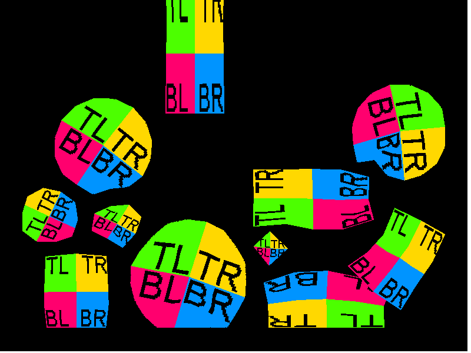

# Softbody Tests
Testing soft-body physics and mesh rendering using LibGDX and Box2d.

### Running
First make sure you have JDK 8 installed. Afterwards navigate to root project directory and run
```
./gradlew run
```

### Video
<a href="https://www.youtube.com/watch?v=xZOO_Oyr9zo">
  
</a>
